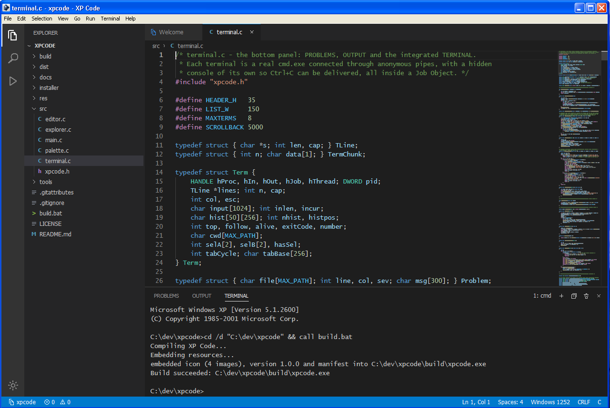

<p align="center">
  
</p>

<h1 align="center">XP Code</h1>

<p align="center">
  A VS Code-style editor in under 200kb and compatible with Windows XP.<br>
  No Electron, and no Chromium - all Win32 C, built with Tiny C Compiler.
</p>

<p align="center">
<a href="https://github.com/PeterWarrington/XP-Code/releases/download/1.0.0/XPCode-1.0.0.msi">Download installer .msi</a>
  <br/>
<a href="https://github.com/PeterWarrington/XP-Code/releases/download/1.0.0/XPCode-1.0.0.exe">Download standalone .exe</a>
</p>



## Features

- **Integrated terminal** – a real `cmd.exe` in the bottom panel, with multiple terminals, command
  history, Tab completion of file names, Ctrl+C to interrupt the running program, mouse selection,
  copy/paste, and scrollback. Killing a terminal also kills every process it started.
- **Problems panel** – compiler errors printed in the terminal (`file:line: error: …` from TCC/GCC,
  `file(line) : error …` from MSVC, Python tracebacks) are collected into the Problems panel and the
  status bar; click one, or Ctrl+click the line in the terminal, to jump to it.
- **Editor** – syntax highlighting for C/C++, Python, JavaScript, Batch, INI, HTML/XML and Markdown;
  line numbers, indent guides, bracket matching, auto-indent, auto-closing brackets and quotes,
  multi-level undo/redo, move/copy/delete line, toggle comment, find and replace, a minimap, and
  automatic reload when a file changes on disk.
- **Workbench** – activity bar, Explorer file tree (create, rename, delete, reveal), Search across
  files, tabs with unsaved-change markers, breadcrumbs, status bar, resizable side bar and panel.
- **Command Palette** (Ctrl+Shift+P / F1), **Quick Open** (Ctrl+P) and **Go to Line** (Ctrl+G) with
  fuzzy matching.
- **Run and build** – F5 runs the active file in the terminal (`.c` is compiled with TCC first,
  `.py` runs with Python, `.bat` with `call`, `.js` with `cscript`); Ctrl+Shift+B runs the
  folder's `build.bat`.
- Remembers the open folder, open files, window layout and zoom level between sessions.

## Install

Download `XPCode-1.0.0.msi` from the releases page and run it. The installer puts XP Code in
`Program Files\XP Code`, adds a Start Menu shortcut and an optional desktop shortcut, and registers
in Add or Remove Programs. Installing a newer version upgrades the old one in place.

Silent install and removal work the usual Windows Installer way:

```
msiexec /i XPCode-1.0.0.msi /qn
msiexec /x XPCode-1.0.0.msi /qn
```

Tested on Windows XP Professional (32-bit).

## Author's note

Is this vibe-coded? Yes. 

Am I proud of this project? I cannot be given I lazily vibe-coded this.

Is it cool and useful though? Undeniably, so I am sharing it.

I did the logo though, so I did do something.

## Compilers and interpreters

XP Code does not ship a compiler. For F5 and the terminal it adds these to `PATH` when they exist:

- Tiny C Compiler in `<XP Code folder>\tcc`, `Program Files\tcc`, `C:\tcc` or `C:\dev\tools\tcc`
- Python in any `C:\Python*` folder

Other locations can be listed in the settings file (`%APPDATA%\XP Code\xpcode.ini`):

```ini
[tools]
path=D:\tools\tcc;D:\Python34
```

## Keyboard shortcuts

| Action | Keys |
| --- | --- |
| Command Palette | Ctrl+Shift+P, F1 |
| Quick Open file | Ctrl+P |
| Go to line | Ctrl+G |
| Toggle terminal / new terminal | Ctrl+\` / Ctrl+Shift+\` |
| Toggle side bar / panel | Ctrl+B / Ctrl+J |
| Explorer / Search / Run | Ctrl+Shift+E / Ctrl+Shift+F / Ctrl+Shift+D |
| Run active file | F5 |
| Run build task | Ctrl+Shift+B |
| Find / replace | Ctrl+F / Ctrl+H |
| Toggle line comment | Ctrl+/ |
| Move / copy line | Alt+Up/Down / Shift+Alt+Up/Down |
| Delete line | Ctrl+Shift+K |
| Next / previous editor | Ctrl+Tab / Ctrl+Shift+Tab |
| Open folder / save all | Ctrl+K Ctrl+O / Ctrl+K S |
| Zoom in / out / reset | Ctrl+= / Ctrl+- / Ctrl+0 |

**Help → Keyboard Shortcuts Reference** lists every command.

## Building from source

Requirements:

- [Tiny C Compiler 0.9.27](https://download.savannah.gnu.org/releases/tinycc/) for Win32
  (`tcc-0.9.27-win32-bin.zip`) with the full Windows headers from `winapi-full-for-0.9.27.zip`
  copied over its `include` folder
- Python 3.4 to 3.12 (used for the resource and installer steps; standard library only -
  the installer needs `msilib`, which was removed in Python 3.13)

```
build.bat [C:\path\to\tcc.exe]      -> build\xpcode.exe
python installer\build_msi.py       -> dist\XPCode-<version>.msi
python tools\make_icon.py           -> res\icon.ico from res\icon.png (only when changing the icon)
```

`build.bat` uses `tcc.exe` from `PATH` when no path is given. A running `build\xpcode.exe` is moved
aside before linking, so XP Code can rebuild itself from its own terminal with Ctrl+Shift+B.

The version number lives in one place: `APP_VERSION` in `src/xpcode.h`. The resource embedder and
the installer both read it from there.

## Project layout

```
src/            the application (C, Win32 API)
  main.c        main window, layout, activity bar, status bar, commands, shortcuts, settings
  editor.c      text engine, syntax highlighting, tabs, breadcrumbs, minimap, find/replace
  explorer.c    side bar: file tree, search across files, run view
  terminal.c    panel: integrated terminal, problems, output
  palette.c     command palette, quick open, go to line, input prompts
  xpcode.h      shared declarations, colours, command IDs
res/            icon.svg (artwork source), icon.png (1024 px export), icon.ico (16-48 px)
tools/          make_icon.py, embed_resources.py
installer/      build_msi.py
docs/           screenshot
build.bat       build script
```

## How it works

- **Drawing.** Everything except the menu bar and the text boxes is drawn with GDI into
  off-screen bitmaps: the activity bar icons are vector paths, the file-type badges are text, and
  the minimap draws each token as a small coloured rectangle.
- **Terminal.** Windows XP has no pseudo-console API, so each terminal runs `cmd.exe` with
  redirected pipes and its own hidden console. Output is read on a background thread and parsed for
  carriage returns, backspaces, form feeds (`cls`) and error locations. Ctrl+C attaches to the
  hidden console with `AttachConsole` and sends `GenerateConsoleCtrlEvent`. Each terminal runs
  inside a Job Object, so killing it, or closing XP Code, also ends its child processes.
- **Resources.** Tiny C Compiler cannot compile `.rc` scripts, so `tools/embed_resources.py` builds
  the icon, version and manifest resources and appends them to the linked executable as a new
  `.rsrc` section.
- **Installer.** `installer/build_msi.py` writes the MSI database directly through Windows
  Installer, using Python's standard `msilib` module, so it needs neither WiX nor .NET.

## Limitations

- Programs run in the terminal see a pipe rather than a console. Many buffer their output until
  they exit (use `python -u`), and full-screen console programs such as `edit` do not work.
- Text is single-byte Windows-1252; UTF-8 and UTF-16 files are not decoded.
- TCC stops at the first error, so a build reports one problem at a time.
- One editor group (no split view), no word wrap, no language server or debugger.

## License

[MIT](LICENSE)
# XP-Code
